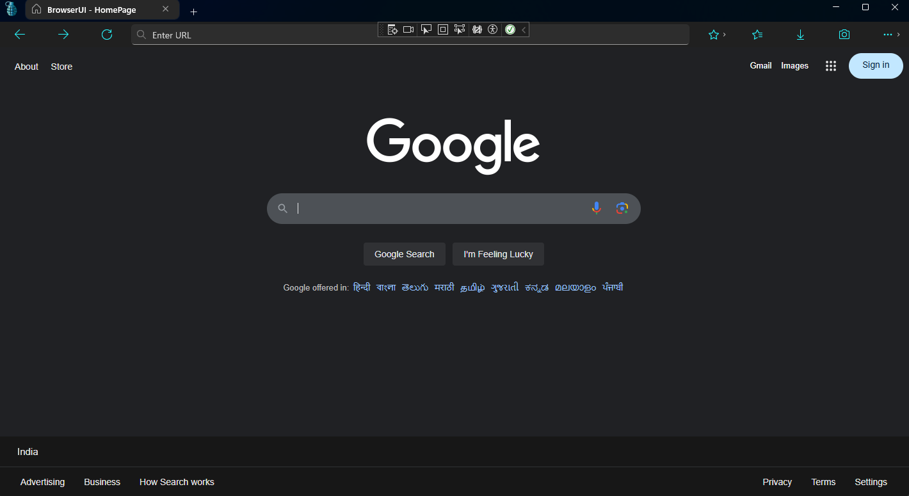
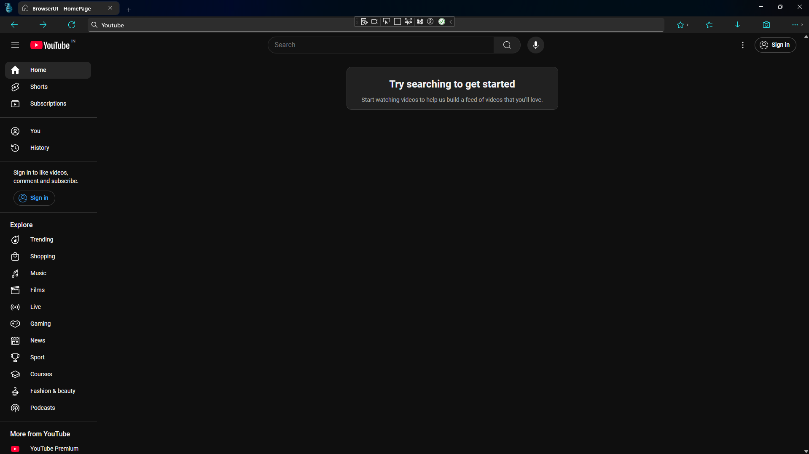

# 🌐 WebView2 Browser - Built with WinUI 3


## 🚀 Overview

**BrowserUI-Chromium** is a **modern, lightweight web browser** built using **WinUI 3** and **WebView2**, offering smooth performance, efficient resource usage, and a custom UI tailored for Windows 10 and 11.

> 📌 *This project is inspired by the WinUI 3 browser development series by [J-Coding](https://www.youtube.com/playlist?list=PLWnCj7nG2WwD7AOWnB4OegNVy_UfpNiN1).*

---

## 📸 Screenshots




---

## 🏗️ Tech Stack

* **[WebView2](https://learn.microsoft.com/en-us/microsoft-edge/webview2/)** – Embeds Microsoft Edge (Chromium) engine inside native apps.
* **[WinUI 3](https://learn.microsoft.com/en-us/windows/apps/winui/winui3/)** – A modern Windows UI framework.
* **C# (.NET 6/7)** – Application logic and interaction.
* **XAML** – User Interface layout and styling.

---

## 🔥 Features

### ✅ Implemented

✔️ **Fast & Lightweight** – Optimized performance with minimal bloat.
✔️ **Custom UI** – Modern and intuitive tabbed interface.
✔️ **Minimal RAM Usage** – Designed for low memory consumption.

### 🛠️ In Progress / Planned

🔹 **Clipboard Manager** – Save, manage, and reuse clipboard snippets.
🔹 **Screenshot Tool** – Capture pages directly from the browser.
🔹 **Performance Monitor** – Display real-time resource usage.
🔹 **Privacy Mode** – Incognito browsing without storing history.
🔹 **Download Manager** – Native file download handling.
🔹 **Extension Support** – Experimental WebView2 extensions support.

---

## 🛠️ Installation

1. **Clone the repository**

   ```sh
   git clone https://github.com/JOSU10xD/BrowserUI-Chromium.git
   cd BrowserUI-Chromium
   ```

2. **Install requirements**

   * ✅ [WebView2 Runtime](https://developer.microsoft.com/en-us/microsoft-edge/webview2/#download-section)
   * ✅ [WinUI 3 SDK via Visual Studio](https://learn.microsoft.com/en-us/windows/apps/winui/winui3/get-started)

3. **Build & Run**
   Open the solution in Visual Studio and run the project.
   Or use:

   ```sh
   dotnet build
   dotnet run
   ```

---

## 📂 Project Structure

```bash
BrowserUI-Chromium/
│── BrowserUI/               # Main project folder
│   ├── Assets/              # Icons and screenshots
│   ├── Views/               # XAML UI layouts
│   ├── Models/              # Data models (planned)
│   ├── Services/            # Browser logic and helpers
│── LICENSE
│── README.md
└── .gitignore
```

---

## 🤝 Contributing

Contributions are welcome! Here's how to get started:

1. Fork the repo
2. Create a new branch (`feature/your-feature`)
3. Commit your changes
4. Open a pull request

---

## 📜 License

This project is licensed under the **MIT License**. See [LICENSE](./LICENSE.txt) for full terms.


